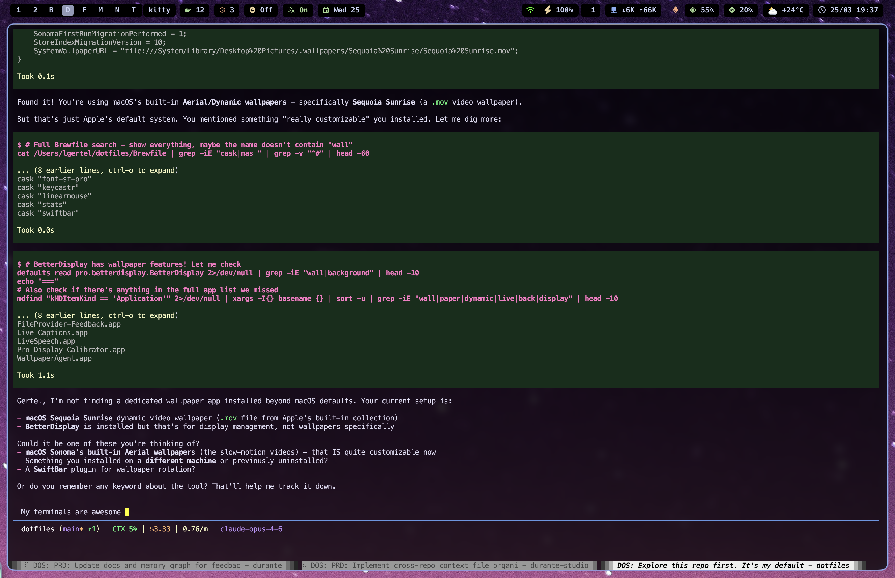

<div align="center">

# ⌨️ Dotfiles

**macOS terminal-first, keyboard-driven development environment**

[](https://github.com/Sin-cy/dotfiles/actions/workflows/lint.yml)


<!-- Replace with your actual screenshot -->


*Catppuccin Mocha terminals · Rose-pine Neovim · Sketchybar · AeroSpace tiling*

</div>

---

## Preview

<!-- Take these screenshots and add to assets/ -->

| Terminal + Sketchybar | Neovim IDE |
|:---:|:---:|
|  |  |

| Tmux Sessions | File Manager (Yazi) |
|:---:|:---:|
|  |  |

---

## What's Included

18 stowable packages — install everything or pick what you need.

### Core

| Tool | Description | Theme |
|------|-------------|-------|
| **[Zsh](docs/zsh/README.md)** | Shell with vi-mode, 70+ aliases, Starship prompt | Catppuccin Mocha |
| **[Neovim](docs/neovim/README.md)** | IDE-like editor — LSP, Snacks picker, 30+ plugins | Rose-pine |
| **[Tmux](docs/tmux/README.md)** | Multiplexer with session persistence, floating tools | Catppuccin Mocha |
| **[Ghostty](docs/ghostty/README.md)** | Primary terminal — 75% opacity, 23px blur | Catppuccin Mocha |

### Window Management & UI

| Tool | Description |
|------|-------------|
| **[AeroSpace](docs/aerospace/README.md)** | i3-like tiling WM with workspace-to-monitor pinning |
| **[Sketchybar](docs/sketchybar/README.md)** | Custom status bar — workspaces, weather, CPU, media, git |
| **[Karabiner](docs/karabiner/README.md)** | Key remapping |
| **[Wallpapers](wallpapers/README.md)** | Per-workspace switching + GLSL shaders (matrix/aurora/flowfield) for Plash |
| **Übersicht** | Webview widgets above wallpaper, below windows |
| **boring.notch** | Notch → Dynamic-Island-style music/calendar/camera (OSS) |

### CLI Tools

| Tool | Description |
|------|-------------|
| **[Yazi](docs/yazi/README.md)** | Terminal file manager with image preview |
| **[Starship](docs/starship/README.md)** | Cross-shell prompt with vi-mode indicators |
| **[Atuin](docs/atuin/README.md)** | Encrypted shell history sync |
| **[W3m](docs/w3m/README.md)** | Terminal web browser with vi-keys |

### Additional Terminals

| Tool | Status |
|------|--------|
| **Alacritty** | Configured, secondary |
| **Kitty** | Configured, secondary |
| **WezTerm** | Configured, secondary |

### Media & Extras

| Tool | Description |
|------|-------------|
| **MPD + rmpc** | Music daemon + TUI player |
| **Zed** | Editor config (lightweight alternative) |
| **Scripts** | tmux-sessionizer, FZF helpers, git integrations |

---

## Quick Start

### Fresh Install (New Machine)

```bash
# 1. Clone
git clone https://github.com/Sin-cy/dotfiles.git ~/dotfiles
cd ~/dotfiles

# 2. Install everything (Homebrew, packages, configs)
./install.sh

# 3. Apply macOS preferences
./macos/.macos

# 4. Configure for your machine
./setup.sh --configure
```

### Options

```bash
./install.sh --dry-run       # Preview without changes
./install.sh --update        # Update only (skip installs)
./install.sh --skip-casks    # Skip GUI apps
./setup.sh --check           # Verify dependencies
./setup.sh --stow            # Re-stow all packages
```

---

## Key Bindings

### Tmux (`Ctrl+Space` prefix)

| Key | Action |
|-----|--------|
| `\|` / `-` | Split horizontal / vertical |
| `H/J/K/L` | Resize panes |
| `Ctrl+g` | Lazygit (floating) |
| `Ctrl+y` | Yazi (floating) |
| `f` | tmux-sessionizer |
| `o` | Session picker |

### Neovim (`Space` leader)

| Key | Action |
|-----|--------|
| `<leader>pf` | Find files |
| `<leader>ps` | Grep search |
| `<leader>pp` | Switch project |
| `<leader>lg` | Lazygit |
| `<leader>ee` | File explorer |
| `s` | Flash jump |
| `<C-e>` | Harpoon menu |

### AeroSpace (`Alt` prefix)

| Key | Action |
|-----|--------|
| `Alt+h/j/k/l` | Focus window |
| `Alt+Shift+h/j/k/l` | Move window |
| `Alt+1/2/B/D/T/M/N` | Switch workspace |
| `Alt+Enter` | New terminal |
| `Alt+Shift+Space` | Fullscreen |

> **Full keybinding reference**: See [CLAUDE.md](CLAUDE.md) for every alias, keybinding, and plugin documented.

---

## Design Principles

- **Vi-mode everywhere** — Zsh, Tmux, Neovim, Yazi, W3m, AeroSpace all use hjkl
- **Keyboard-driven** — Mouse optional, everything reachable via keybindings
- **Consistent theming** — Catppuccin Mocha (terminal tools) + Rose-pine (Neovim)
- **Transparent terminals** — 75% opacity + 23px blur, wallpaper shows through
- **Modular** — Each tool independently stowable via GNU Stow
- **Reproducible** — Brewfile + install script + macOS defaults = full setup in one command

---

## Directory Structure

```
dotfiles/
├── aerospace/        → ~/.config/aerospace/
├── alacritty/        → ~/.config/alacritty/
├── atuin/            → ~/.config/atuin/
├── ghostty/          → ~/.config/ghostty/
├── karabiner/        → ~/.config/karabiner/
├── kitty/            → ~/.config/kitty/
├── macos/            → macOS system defaults script
├── mpd/              → ~/.config/mpd/
├── nvim/             → ~/.config/nvim/
├── rmpc/             → ~/.config/rmpc/
├── scripts/          → ~/scripts/
├── sketchybar/       → ~/.config/sketchybar/
├── starship/         → ~/.config/starship/
├── tmux/             → ~/.config/tmux/
├── w3m/              → ~/.w3m/
├── wallpapers/       → GLSL shader pages for Plash + per-workspace asset notes
├── wezterm/          → ~/.config/wezterm/
├── yazi/             → ~/.config/yazi/
├── zed/              → ~/.config/zed/
├── zsh/              → ~/.zshrc, ~/.zprofile
├── Brewfile          # All Homebrew packages
├── install.sh        # Automated installer
├── setup.sh          # Post-clone configuration
├── CLAUDE.md         # AI assistant context (full reference)
└── docs/             # Per-tool documentation
```

---

## Stow Commands

```bash
cd ~/dotfiles

# Stow one package
stow -t ~ nvim

# Re-stow (update symlinks)
stow -R -t ~ nvim

# Unstow
stow -D -t ~ nvim

# Stow everything
stow -t ~ aerospace atuin ghostty karabiner mpd nvim rmpc \
         scripts sketchybar starship tmux w3m yazi zed zsh
```

---

## Monitor Setup

Dual-monitor with AeroSpace workspace pinning:

| Monitor | Type | Workspaces |
|---------|------|-----------|
| **DEV-MAIN** | Built-in Retina XDR (3456×2234) | 1, B(rowser), D(ev), M(essaging), N(otes), E(mail) |
| **PORTRAIT** | External 90° (2880×5120) | 2, T(erminal) |

Edit `~/.config/aerospace/aerospace.toml` with your monitor names after install.

---

## Documentation

Full reference for every tool, keybinding, alias, and plugin is in **[CLAUDE.md](CLAUDE.md)** — designed as both human documentation and AI assistant context.

Per-tool docs are in the [`docs/`](docs/) directory.

The [documentation site](https://sin-cy.github.io/dotfiles/) provides a searchable, browsable version.

---

## Troubleshooting

<details>
<summary><b>Stow conflicts</b></summary>

```bash
mv ~/.config/nvim ~/.config/nvim.bak
stow -t ~ nvim
```

</details>

<details>
<summary><b>Commands not found</b></summary>

```bash
source ~/.zprofile && source ~/.zshrc
```

</details>

<details>
<summary><b>Neovim plugins not loading</b></summary>

```bash
nvim +Lazy sync +qa
```

</details>

<details>
<summary><b>Tmux plugins not loading</b></summary>

```bash
# Inside tmux: prefix + I (Ctrl+Space, Shift+I)
```

</details>

---

<div align="center">

**[Full Reference (CLAUDE.md)](CLAUDE.md)** · **[Docs Site](https://sin-cy.github.io/dotfiles/)** · **[Install Guide](README_NEW_MACOS.md)**

</div>
