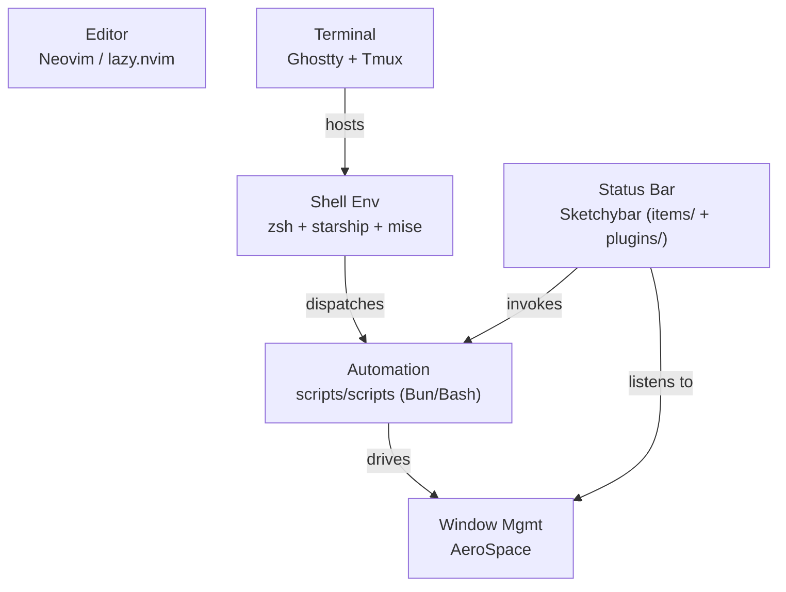

# Container Diagram (C4 Level 2)
<!-- Auto-generated by sentinel scan on 2026-06-18 -->

The deployable units are the major configuration subsystems, each a Stow package, coordinated at runtime through Sketchybar and the shell automation layer.

