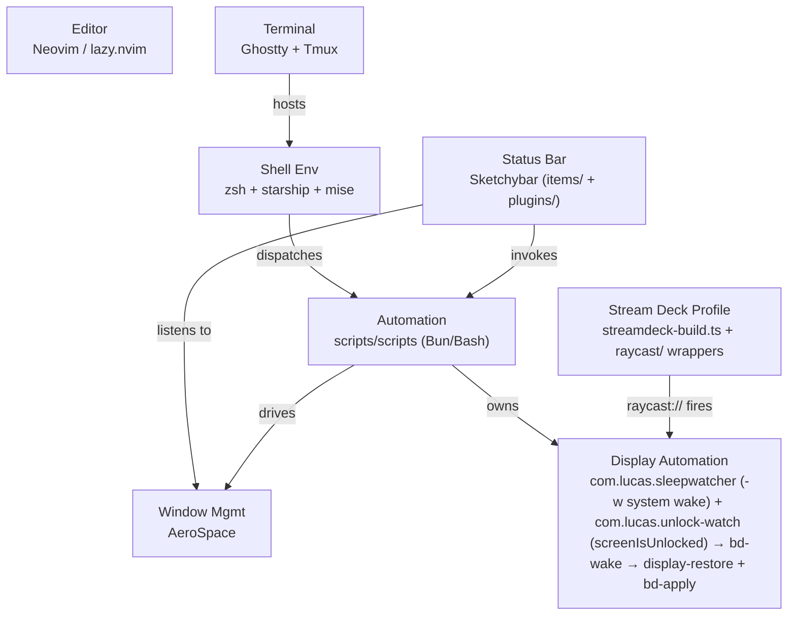

# Container Diagram (C4 Level 2)
<!-- Auto-generated by sentinel scan on 2026-06-22; display-automation node updated by the 2026-06-24 delta re-scan (added com.lucas.unlock-watch). -->

The deployable units are the major configuration subsystems, each a Stow package, coordinated at runtime through Sketchybar and the shell automation layer. A display-automation unit (sleepwatcher for system wake + a compiled unlock-watch helper for screen unlock) and a generated Stream Deck profile sit alongside.

