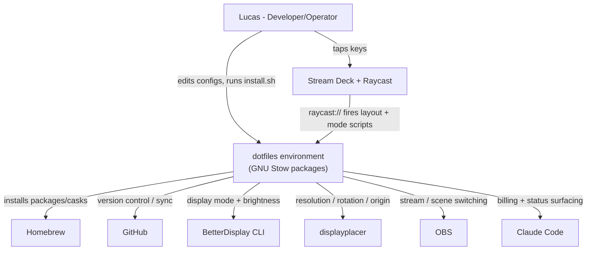

# System Context (C4 Level 1)
<!-- Auto-generated by sentinel scan on 2026-06-22 -->

The dotfiles environment is operated by a single developer and provisions a macOS workstation, integrating with Homebrew, GitHub, BetterDisplay, displayplacer, OBS, Stream Deck + Raycast, and Claude Code.

