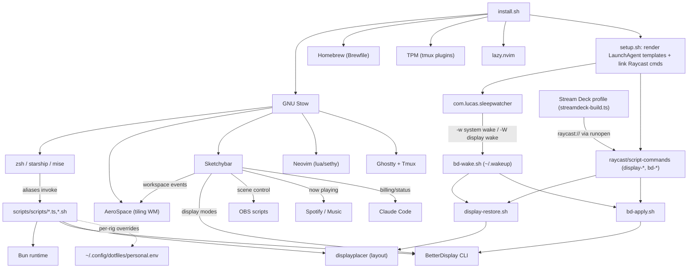

# Module Map
<!-- Auto-generated by sentinel scan on 2026-06-22 -->

Stow is the single deployment spine; Sketchybar is the runtime integration hub wiring window-manager events, display modes, and media/billing status into one bar. Shell aliases dispatch the Bun/Bash automation under `scripts/scripts/`. A display-automation subsystem (sleepwatcher → bd-wake → display-restore + bd-apply) keeps layout/brightness stable across display-wake, and a generated Stream Deck profile fires Raycast script-commands into the same scripts.

