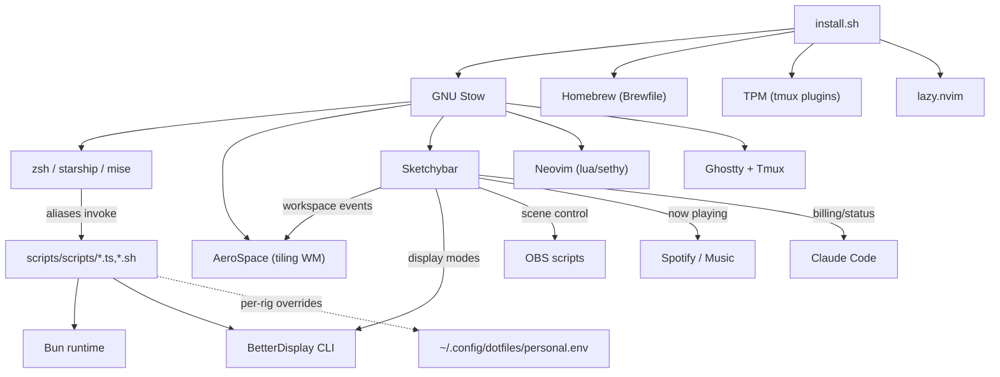

# Module Map
<!-- Auto-generated by sentinel scan on 2026-06-18 -->

Stow is the single deployment spine; Sketchybar is the runtime integration hub wiring window-manager events, display modes, and media/billing status into one bar. Shell aliases dispatch the Bun/Bash automation under `scripts/scripts/`.

